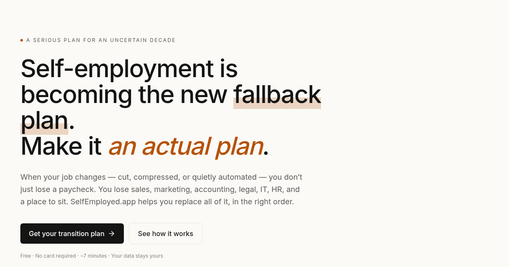

# SelfEmployed.app

> **Self-employment is becoming the new fallback plan. Make it an actual plan.**

[](https://selfemployed.app)
[](https://selfemployed.app/perspective/)
[](https://developers.cloudflare.com/workers-ai/)
[](LICENSE)



A working AI-powered transition platform for people pivoting from employment to self-employment — by choice or because their job is going away. The wedge is a free Diagnostic: paste your work history, get back a real plan in under ten minutes.

**[→ Try it: selfemployed.app](https://selfemployed.app)**

## What it does

Paste a resume or describe your last job, and the Diagnostic returns:

| | |
| --- | --- |
| **Displacement risk** | Honestly calibrated — which subtasks of your role are commoditizing, which are still defensible |
| **Three viable solo paths** | Ranked by fit + market reachability + time to first dollar |
| **A productized first offer** | Specific buyer, specific deliverable, specific price — not "consulting" |
| **90-day plan** | Week-by-week actions to land your first paying client |
| **First 25 prospects** | Real target customers with the signal that suggests they would buy |
| **Today's first five actions** | You can start in the next hour |

Four demo personas walk through the experience without typing your own resume:

- **[Sarah Chen](https://selfemployed.app/?demo=sarah)** — Customer support manager → AI-enabled CX automation consultant
- **[Marcus Rivera](https://selfemployed.app/?demo=marcus)** — Recruiter → Fractional hiring partner
- **[Priya Shah](https://selfemployed.app/?demo=priya)** — Lifecycle marketer → 30-day productized sprints
- **[Alex Park](https://selfemployed.app/?demo=alex)** — Junior developer → Two-week AI builds (side income)

## Five product decisions

1. **Horizontal audience from day one.** Serves any displaced knowledge worker. The bet: frontier AI models can produce vertical-quality output without curated per-niche playbooks.
2. **Free Diagnostic forever; paid Command Center only after first paying client lands.** We do not charge anxious pre-revenue users.
3. **AI-assisted, not autonomous.** Every external action requires your approval. No autonomous outreach, contracts, or money movement at v1. Trust is earned in single approvals.
4. **Pipeline first, books second.** New self-employed people fail from no customers, not bad bookkeeping.
5. **Adult voice.** No "be your own boss." Honest about why people are arriving.

For the full thesis, read [**The microcompany of one**](https://selfemployed.app/perspective/) — a ~9-minute essay on what the labor data actually says, why most of the existing advice is wrong, and what people who care should be doing now.

## Stack

- One static `index.html` (~120 KB) — no build step
- React 18 via esm.sh import map
- Tailwind via CDN with custom theme tokens
- Source Serif 4 + Inter via Google Fonts
- Lucide icons via esm.sh
- **Real AI inference** via Cloudflare Pages Function (`/api/diagnose`) → Workers AI (Llama 3.3 70B, free tier, no external keys)
- Deployed to Cloudflare Pages with a custom domain

## Running it locally

```bash
python3 -m http.server 8742
# open http://localhost:8742
```

For the AI endpoint to work locally you would need `wrangler pages dev` with the AI binding. The static UI works without it (demo personas only).

## Deployment

The site auto-deploys when pushed; manually:

```bash
wrangler pages deploy dist --project-name=selfemployed-app
```

Custom domain attached via the Pages custom-domains API with apex + `www` CNAMEs pointing at `selfemployed-app.pages.dev`.

## Status

This is a working AI-powered tool, not a static demo. Anyone visiting can paste any resume and get a real generated plan in ~25 seconds via Workers AI.

Roadmap:
- Upgrade the inference backend from Llama 3.3 70B to Claude (key swap) — Llama is the floor, Claude is the ceiling
- Stream the response so the user sees the plan being written
- Auth + persistence so users can return to their plan
- A real prospect-research backend (Google Maps / Apollo / web search) for the Pipeline Helper
- Stripe paywall logic for post-first-client Command Center billing
- Cloudflare Web Analytics (one-click enable in dashboard)

## License

AGPL-3.0. The model is welcome to copy; the substrate is not.
